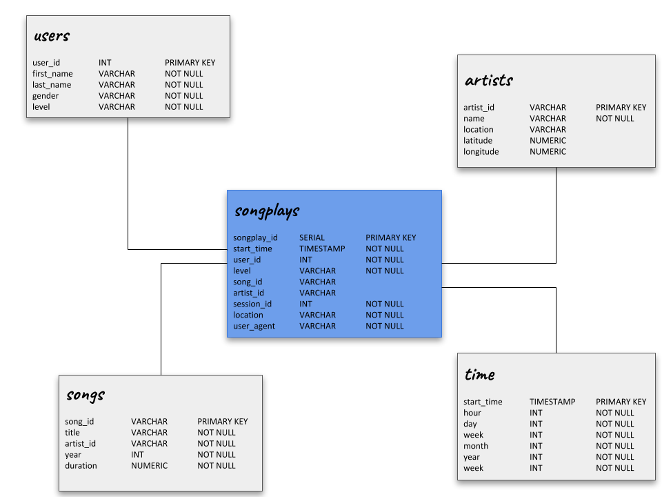

# Sparkify
### Data modeling with Postgres

This project aims to modeling the database and keep the information about the usage of Sparkify. 

The importance of this is the development of an automatic process to make it easier to transfer the data from json files to the Postgres creating a structure where the analysis using the startup data could be made and used to organize data and facilitate insights about how improve the company.

## Database structure
The image below represents the schema choosen to our database:


In this project we are woorking with a star schema which consists in a fact table referencing multiples dimensions tables. It is a simple schema focused in make fast aggregations and guarantee easiers queries.

The name of our fact table is songplays and there we are going to keep the data about the song played on Sparkify. It is the main information about the startup and where we can make some analyzis to better understand the user and your preferences.

Besides that, the schema contains four more dimensions tables (users, songs, artists and time) where is the data that categorize the information we find in songplays table.
The information contained in each table is described here:

+ ***users***: users in the app
+ ***songs***: songs in music database
+ ***artists***: artists in music database
+ ***time***: timestamps of records in songplays broken down into specific units

## How to execute the project
While we are in development, the first step to test this project is clean all existing databases and create them again. This way we will always be working with a clean database. So, the first step is run the code below:

``` 
$ python create_tables.py
```

After this, we execute the script that processes all files and, from them, inserts the values in each table.

```
$ python etl.py
```

### create_tables.py functions
+ **drop_tables**
It uses the list of drop tables queries in sql_queries.py and processes each one to clean the existing database.

+ **create_tables**
It drops the database and creates it again, then uses the list of created tables queries in sql_queries.py and processes each one to create the tables.

+ **main**
It executes the functions above. It is necessary to execute first the drop_tables and after the create_tables.

### etl.py functions
+ **copy_file_to_database**
It receives the connection cursor, the table name where we will copy the data, the dataframe with the data and an optional parameter which is the list of columns. This functions will create a file from the dataframe and will use it with the query *table_copy* defined in *sql_queries.py* to insert the data. The table name and the list of columns, if exists, are used to complete the query. 

*PS: this function is only used to insert the data in the table songplays because this is the only one with a serial primary key, so will not exist any conflicts in this case.*

+ **process_song_file**
It receives the connection cursor and filepath. All filepaths this function receives are from the files whose information gives us an song and the artist data, thus we open the file with pandas, get the information that is important to each table and execute the inserts commands.

+ **process_log_file**
It receives the connection cursor and filepath. All filepaths this function receives are from the files whose information give us an time and the user data, besides other information we can use to find the song and artist to complete the data to fill songplays table. 

To do this we open the file with pandas, using it to create an user object and then we use the column with timestamp to create a new dataframe with all information about the date. 

After this, we can use a query from *sql_queries.py* to get the information about artist and song and with this we can call the **copy_file_to_database** function to fill the songplays table.

+ **process_data**
It receives the database connection, the connection cursor, a path and a function. The objective here is to get the directory path and create a list with all filespath to process. For each filepath we are going to call the function specified to insert the data and after this, we commit to persist the information in the database.

+ **main**
It opens the conection with the database, creates the cursor and calls the **process_data** twice. The first one is to process the song_data, so we pass the function **process_song_file** as parameter, and the second is to process the log_data, so we pass the function **process_log_file** as parameter.

## Studying the data 
There is a file where we would see some analysis about the information imported to our database. To see it, after run this two scripts above, it is necessary only open the file *analysis.ipynb* and run again the rows.